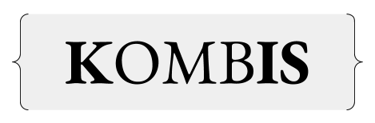

### 
### A DSL Compiler for Combinatory Logic based on the universal formal system SKI Combinator Calculus

## Background
Combinatory logic is a notation to eliminate the need for quantified variables in **mathematical logic**. It was introduced by **Moses Schönfinkel** and **Haskell Curry**, and has more recently been used in computer science as a **theoretical model of computation** and also as a basis for the design of **functional programming languages**.

SKI Combinator Calculus is a **combinatory logic**, a **Computational System** or **Model of Computation** which may be perceived as reduced version of **untyped lambda calculus**. It can be thought of as a computer programming language, though it is not convenient for writing software. Instead, it is important in the mathematical theory of algorithms because it is an extremely simple Turing complete language.

## Implementation
Combi can be used as a **Embedded DSL** inside of Javascript using **Tagged String Templates**. The DSL completly supports **SKI Combinator Calculus Grammer** which is then **transformed** or **compiled** into **Javascript( >= ES6 )** this transformation is applied using a, **Tag** on **String Template** which will contain the Combi/SKI **Code**. Combi allows you to write very complicated functional hybird **SKI** compositions which allows **infusion** of Javascript with **SKI Combinator Calculus** in a **concise** manner. Complex **Compositions** and **Representations** are easier to write in Combi rather than native Javascript. Kombis also provides the facility for user defined combinators with two possible ways first is defining a custom combinator by writing **javascript transforms** or defining a custom combinator using **macro transforms**.

## Usage

#### `Compilation (to Javascript)`
```javascript
let compiled = combc`...`
```

#### `Compilation and Execution`
```javascript
let output = combi`...`
```

## Examples
### Encoding TRUE
```javascript
combi`(K)`
```

### Encoding FALSE
```javascript
combi`(SK)`
```

### Using Custom Primitive Values in conjunction with Combi
```javascript
combi`((K(I ${false})(I(I ${10}))))`
```
### Recursion
> This will lead to Infinite Recursion

Recursion in **SKI Combinator Calculus** and **Lambda Calculus** is achieved by Fixed-point combinators and
the infamous **Y Combinator** discovered by **Haskell Curry** 

There are two ways to encode it

#### `Variant 1`(Good for understanding)

Derivation 1
```
S(Kα)(SII)(S(Kα)(SII))
= Kα(S(Kα)(SII))(SII(S(Kα)(SII)))
= α(S(Kα)(SII)(S(Kα)(SII)))
= α(α(S(Kα)(SII)(S(Kα)(SII))))
= α(α(α(S(Kα)(SII)(S(Kα)(SII)))))
= ...
```

Derivation 2
```
β = S(Kα)(SII)
SIIβ 
= ββ
= (S(Kα)(SII))β 
= Kαβ(SIIβ) 
= α(SIIβ) 
= α(ββ)
= α(α(ββ))
= α(α(α(ββ)))
= ...
```

Combi Code
```javascript
combi`(S(K ${x => 10})(SII)(S(K ${x => 10})(SII)))`
```

#### `Variant 2`(Standard Way and Easy to use)
```javascript
combi`(S(K(SII))(S(S(KS)K)(K(SII))) ${x => 10})`
```

#### `Variant 3`(Built-in)
```javascript
combi`(Y ${x => 10})`
```
